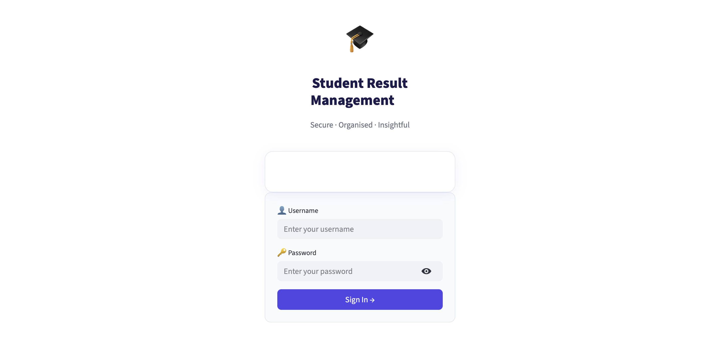
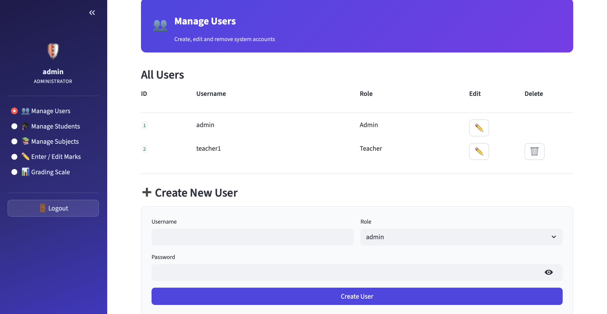
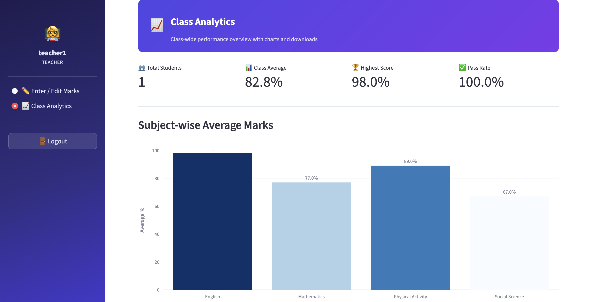
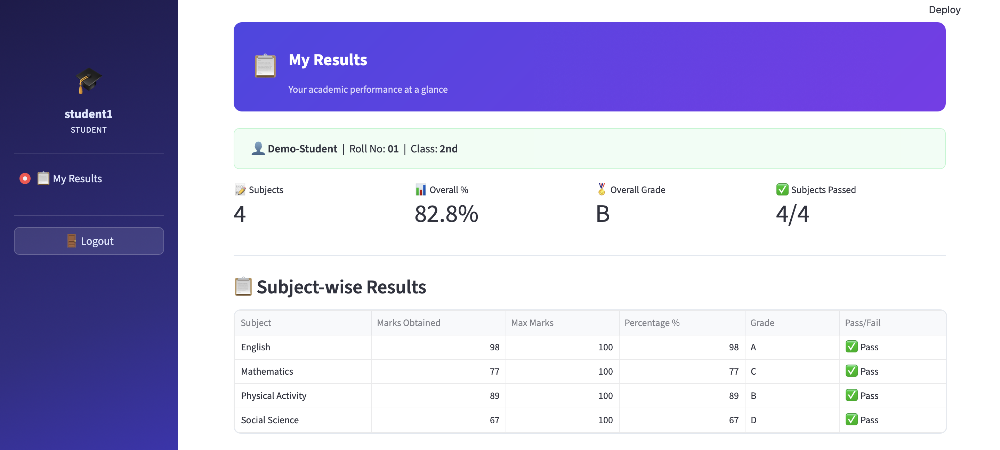
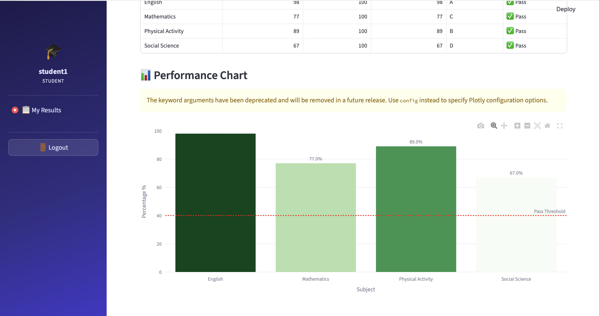

<div align="center">

# 🎓 Student Result Management System

**A modern, role-based academic result management platform built with Python, SQLite & Streamlit.**

[](https://python.org)
[](https://streamlit.io)
[](https://sqlite.org)

</div>

---

## ✨ Overview

**SRMS** is a full-featured student result management system that lets **Admins**, **Teachers**, and **Students** interact with academic data through a clean, responsive Streamlit interface. Results are stored locally in SQLite — no external database needed.

---

## 🚀 Features

### 🛡️ Admin

- Full CRUD for users, students, and subjects
- Enter and edit marks for any student
- Configure the grading scale (thresholds stored in the database — changes apply instantly)
- Role-based access control with bcrypt-hashed passwords

### 👩‍🏫 Teacher

- Enter and edit marks for students
- Class-wide analytics dashboard with interactive Plotly charts
- Subject-wise average visualisation
- Top 5 / Bottom 5 performer lists
- Download class report as **CSV** or **PDF**

### 🎓 Student

- View personal results per subject (marks, percentage, grade, pass/fail)
- Overall performance summary with KPI metrics
- Interactive performance bar chart with pass-threshold line
- Download personal report as **CSV** or **PDF**

### 🎨 UI

- Polished, wide-layout Streamlit interface
- Indigo gradient sidebar, styled metric cards, grade badges
- Inter font, consistent colour palette throughout
- Responsive column layouts

---

## 🗂️ Project Structure

```
student-result-management-system/
├── app.py                        # Streamlit entry point & routing
├── requirements.txt
├── assets/
│   └── style.css                 # Custom CSS (fonts, cards, sidebar, badges)
├── auth/
│   └── auth.py                   # bcrypt login, logout, session helpers
├── db/
│   ├── schema.sql                # SQLite DDL — all 5 tables
│   └── database.py               # Connection, init_db, seed_defaults
├── models/
│   ├── user.py                   # User CRUD
│   ├── student.py                # Student CRUD
│   ├── subject.py                # Subject CRUD
│   ├── result.py                 # Result queries & upsert
│   └── grading.py                # Grading scale queries & grade computation
├── pages/
│   ├── admin/
│   │   ├── dashboard.py          # Admin sidebar navigation
│   │   ├── manage_users.py
│   │   ├── manage_students.py
│   │   ├── manage_subjects.py
│   │   ├── manage_marks.py
│   │   └── grading_scale.py
│   ├── teacher/
│   │   ├── dashboard.py          # Teacher sidebar navigation
│   │   ├── enter_marks.py
│   │   └── analytics.py          # Class analytics + charts + downloads
│   └── student/
│       ├── dashboard.py          # Student sidebar navigation
│       └── my_results.py         # Personal results + charts + downloads
└── utils/
    ├── ui.py                     # inject_css, page_header, grade_badge
    ├── report_csv.py             # CSV export via pandas
    └── report_pdf.py             # PDF export via fpdf2
```

---

## 🗄️ Database Schema

| Table           | Key Columns                                          |
| --------------- | ---------------------------------------------------- |
| `users`         | `id`, `username`, `password_hash`, `role`            |
| `students`      | `id`, `name`, `roll_number`, `class_year`, `user_id` |
| `subjects`      | `id`, `name`, `max_marks`                            |
| `results`       | `id`, `student_id`, `subject_id`, `marks_obtained`   |
| `grading_scale` | `id`, `grade`, `min_percentage`, `max_percentage`    |

---

## 📊 Default Grading Scale

> Configurable by Admin — stored in the database.

| Grade | Min % | Max % |
| ----- | ----- | ----- |
| **A** | 90    | 100   |
| **B** | 80    | 89.99 |
| **C** | 70    | 79.99 |
| **D** | 60    | 69.99 |
| **E** | 50    | 59.99 |
| **F** | 0     | 49.99 |

---

## ⚡ Quick Start

### Prerequisites

- Python **3.10+**
- `pip`

### 1 — Clone the repository

```bash
git clone https://github.com/srishti-soni/student-result-management-system.git
cd student-result-management-system
```

### 2 — Create a virtual environment

```bash
python -m venv .venv
source .venv/bin/activate        # macOS / Linux
# .venv\Scripts\activate         # Windows
```

### 3 — Install dependencies

```bash
pip install -r requirements.txt
```

### 4 — Run the app

```bash
streamlit run app.py
```

The app will open at **http://localhost:8501**.

---

## 🔑 Default Credentials

| Role    | Username   | Password     |
| ------- | ---------- | ------------ |
| Admin   | `admin`    | `admin123`   |
| Teacher | `teacher1` | `teacher123` |

> **Important:** Change these passwords immediately after first login via the _Manage Users_ page.

---

## 🖼️ Screenshots

> _Add your screenshots to `docs/screenshots/` and update the paths below._

| Login                                | Admin Dashboard                      | Teacher Analytics                            |
| ------------------------------------ | ------------------------------------ | -------------------------------------------- |
|  |  |  |

| Student Results                          | Grading Scale                            |
| ---------------------------------------- | ---------------------------------------- |
|  |  |

---

## 🛠️ Tech Stack

| Technology                                 | Purpose                        |
| ------------------------------------------ | ------------------------------ |
| [Python 3.10+](https://python.org)         | Core language                  |
| [Streamlit](https://streamlit.io)          | Web UI framework               |
| [SQLite](https://sqlite.org)               | Embedded database              |
| [bcrypt](https://pypi.org/project/bcrypt/) | Password hashing               |
| [Pandas](https://pandas.pydata.org)        | Data manipulation & CSV export |
| [Plotly](https://plotly.com/python/)       | Interactive charts             |
| [fpdf2](https://py-pdf.github.io/fpdf2/)   | PDF report generation          |

---

## 🤝 Contributing

Contributions are welcome!

1. Fork the repository
2. Create a feature branch: `git checkout -b feature/your-feature`
3. Commit your changes: `git commit -m "feat: add your feature"`
4. Push to the branch: `git push origin feature/your-feature`
5. Open a Pull Request

Please follow [Conventional Commits](https://www.conventionalcommits.org/) for commit messages.

---

<div align="center">
Srishti Soni
</div>
